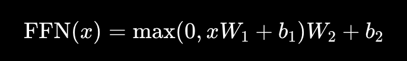

## What is a Transformer Block?

A transformer is made of repeated transformer blocks

GPT models stack MANY of these.

### Example:
```
GPT-2 → dozens of blocks
GPT-4 → many more
```
Simplified Transformer Block

A transformer block contains:

Input Embeddings
      ↓
Self-Attention
      ↓
Add & Normalize
      ↓
Feed Forward Network
      ↓
Add & Normalize
      ↓
Output
## Components We Will Build

Today we build:

- Self-Attention
- Residual Connection
- Layer Normalization
- Feed Forward Network

ALL manually.

## Why Residual Connections Exist

Very important concept.

Instead of completely replacing old information transformers do,
```
new_output + original_input
```
This helps:
1. Gradient flow
2. Stable training
2. Deeper networks

## Why Layer Normalization Exists

Deep networks become unstable.

LayerNorm:

stabilizes values
improves training
prevents exploding activations
## Why Feed Forward Network Exists

Attention learns `relationships`

Feedforward learns 
1. deeper transformations
2. nonlinear patterns
## FULL MINI TRANSFORMER BLOCK

Now type this slowly and carefully.

## STEP 1 — Import NumPy
```python
import numpy as np
```
## STEP 2 — Input Embeddings

Suppose sentence:
```python
i love ai
```
#### Embeddings:
```python
embeddings = np.array([
    [1.0, 0.0, 1.0],
    [0.0, 2.0, 0.0],
    [1.0, 1.0, 0.0]
])

print("INPUT EMBEDDINGS:")
print(embeddings)
```

## STEP 3 — Create Q, K, V Weights
```python
Wq = np.random.rand(3, 3)
Wk = np.random.rand(3, 3)
Wv = np.random.rand(3, 3)
```

## STEP 4 — Compute Q, K, V
```python
Q = embeddings @ Wq
K = embeddings @ Wk
V = embeddings @ Wv
```
## STEP 5 — Attention Scores
```python
scores = Q @ K.T
```

## STEP 6 — Scale Scores
```python
dk = K.shape[1]

scaled_scores = scores / np.sqrt(dk)
```

## STEP 7 — Softmax Function
```python
def softmax(x):

    exp_x = np.exp(x)

    return exp_x / np.sum(exp_x, axis=1, keepdims=True)
```

## STEP 8 — Attention Weights
```python
attention_weights = softmax(scaled_scores)

print("ATTENTION WEIGHTS:")
print(attention_weights)
```

## STEP 9 — Attention Output
```python
attention_output = attention_weights @ V

print("ATTENTION OUTPUT:")
print(attention_output)
```

## Residual Connection

VERY important transformer innovation.

Formula
```
Output=AttentionOutput+InputEmbeddings
```

```python
residual_output = attention_output + embeddings

print("RESIDUAL OUTPUT:")
print(residual_output)
```
## Why This Matters

Without residuals:
- Deep transformers become unstable
- Gradients vanish

Residuals preserve original information.

## Layer Normalization
Now stabilize activations.
Simple LayerNorm Function
```python
def layer_norm(x, epsilon=1e-6):

    mean = np.mean(x, axis=-1, keepdims=True)

    variance = np.var(x, axis=-1, keepdims=True)

    normalized = (x - mean) / np.sqrt(variance + epsilon)

    return normalized
```
## Apply LayerNorm
```python
normalized_output = layer_norm(residual_output)

print("NORMALIZED OUTPUT:")
print(normalized_output)
```

## Feed Forward Network (FFN)

Now apply deeper transformation.

Transformer FFN

Usually:


## Simplified Version
### Create FFN Weights
```python
W1 = np.random.rand(3, 4)
W2 = np.random.rand(4, 3)
```
## ReLU Activation
```python
def relu(x):

    return np.maximum(0, x)
```
## Feed Forward Computation
```python
ffn_hidden = relu(normalized_output @ W1)

ffn_output = ffn_hidden @ W2

print("FFN OUTPUT:")
print(ffn_output)
```
## What Happened?

We

1. expanded dimensions
2. applied nonlinearity
3. projected back

This helps transformers learn complex patterns.

## Second Residual Connection

Transformers again preserve information.

```python
final_output = ffn_output + normalized_output

print("FINAL OUTPUT:")
print(final_output)
```

## Second Layer Normalization

```python
final_normalized = layer_norm(final_output)

print("FINAL NORMALIZED OUTPUT:")
print(final_normalized)
```

## What You Actually Built

Your pipeline:

Embeddings
   ↓
Self-Attention
   ↓
Residual Add
   ↓
LayerNorm
   ↓
FeedForward Network
   ↓
Residual Add
   ↓
LayerNorm