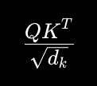

# Self-Attention — The Core Transformer Innovation

This is the mechanism that made:
- ChatGPT
- GPT-4
- Gemini
- Claude
- modern LLMs possible

## What Problem Does Self-Attention Solve?

Language depends on context

Example:
```
The animal didn’t cross the road because it was tired.
```
Question:
What is `it`? <br>
Transformer learns 'it' is 'animal' through attention.

## Another Example
```
I deposited money in the bank.
```
vs
```
The boat reached the river bank.
```

Same word `bank` in different meaning.

Self-attention helps transformer understand context.

## What is Self-Attention?

Self-attention means each token looks at other tokens to decide which **tokens are important**.

#### Human Analogy

When humans read:
```
The student solved the problem because she studied hard.
```
Your brain automatically connects:
```
she → student
```
Self-attention tries to do this mathematically.

### 3. Big Picture of Self-Attention

Suppose tokens:
```
["i", "love", "ai"]
```
Each token asks:

Which other words should I pay attention to?
Example
For token:
```
love
```
attention may focus strongly on:
```
i
ai
```
because they are related.

## How Self-Attention Works (Intuitive)

### Step 1: Create Q, K, V vectors
For each token, create:

Query (Q): What am I looking for?

Key (K): What do I offer?

Value (V): What information do I carry?

Think of it like a database:

Query → Search

Key → Index

Value → Content

## Let’s Build Self-Attention From Scratch
We’ll build:
- embeddings
- Q, K, V matrices
- attention scores
- softmax
- weighted output

### STEP 1 — Import NumPy
```python
import numpy as np
```
### STEP 2 — Create Embeddings
```
i love ai
```
We already encoded it.

Now embeddings:
```python
embeddings = np.array([
    [1.0, 0.0, 1.0],   # i
    [0.0, 2.0, 0.0],   # love
    [1.0, 1.0, 0.0]    # ai
])

print(embeddings)
```

### Applying padding
embedding dimension = 3
### STEP 3 — Create Weight Matrices
Transformers learn separate matrices for:
- Query
- Key
- Value
```python
Wq = np.random.rand(3, 3)
Wk = np.random.rand(3, 3)
Wv = np.random.rand(3, 3)
```

#### Why 3x3?

Because `embedding dimension = 3`

### STEP 4 — Compute Q, K, V

Now transform embeddings.

```python
Q = embeddings @ Wq
K = embeddings @ Wk
V = embeddings @ Wv

print("Q:\n", Q)
print("\nK:\n", K)
print("\nV:\n", V)
```

`@` means Matrix multiplication

### STEP 5 - Compute attention Score
#### Query compares with Keys

This determines:
how much attention to pay.

```python
scores = Q @ K.T

print(scores)
```

#### What Is Happening?
Every token compares with every other token.

### STEP 6 : Scale Scores

Transformer paper uses:


Why?

To stabilize gradients.

```python
dk = K.shape[1]

scaled_scores = scores / np.sqrt(dk)

print(scaled_scores)
```

### STEP 7 Apply Softmax
Softmax converts scores into **probabilities**

```python
def softmax(x):
    
    exp_x = np.exp(x)
    
    return exp_x / np.sum(exp_x, axis=1, keepdims=True)

attention_weights = softmax(scaled_scores)

print(attention_weights)
```

### STEP 8: Compute Final Attention Output

Now use weights on Values.

```python
Output = attention_weights @ V

print(output)
```


Embeddings
   ↓
Q, K, V
   ↓
Attention Scores
   ↓
Softmax
   ↓
Weighted Sum
   ↓
Context-Aware Embeddings