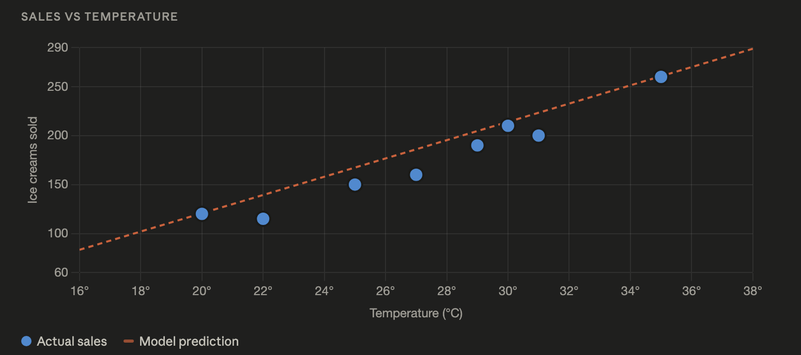
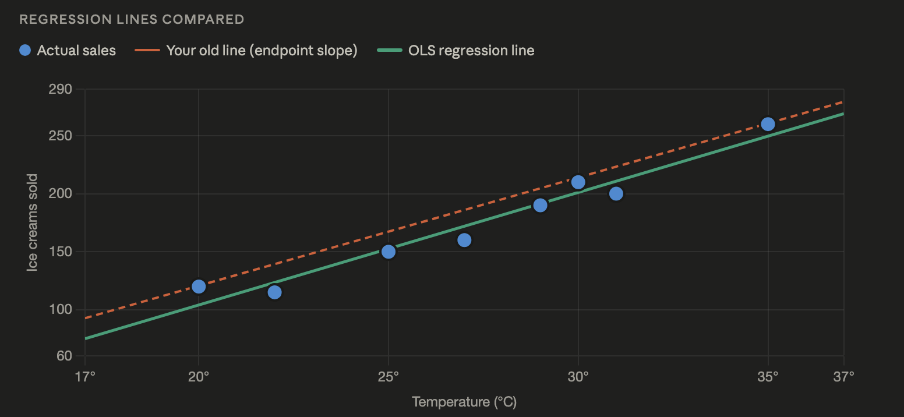

# Problem Statement

An ice cream shop owner wants to predict daily ice cream sales using temperature

But real customers behave unpredictably.

Some days:

- rain happens
- holidays increase sales
- weekends affect demand
- people buy less despite heat

So data becomes irregular.

### Creating irregular dataset
```python
# realistic_sales_prediction.py

temperature = [20, 22, 25, 27, 30, 31, 29, 35]
icecream_sales = [120, 115, 150, 160, 210, 200, 190, 260]

print("Temperature Data:", temperature)
print("Sales Data:", icecream_sales)
```

## Step 1: Understand the Data
Now print relationships:
```python
for i in range(len(temperature)):
    print(
        temperature[i],
        "°C ->",
        icecream_sales[i],
        "ice creams sold"
    )
```
### OBSERVE 
Do sales increase perfectly every time? - NO.

Example:
```
30°C -> 210
31°C -> 200
```
Even though temperature increased:
sales decreased.

WHY?
Possible reasons:

- rain
- weekday
- fewer customers
- pricing changes
- competition
- local events

This is REAL-WORLD MACHINE LEARNING

### Machine Learning does NOT learn perfect rules It learns **"probable patterns"**

## Step 2: Find General Tread
Even though data is messy, Can you observe any trend?
```
higher_temperature -> generally higher sales (NOT always)
```
It is not perfect but General trend.

## Step 3 : Calculate Approximate Slope
Previously we used only two points.
Now the data is irregular so we take first and last  points and calculate initally and let's see.
```python
total_temp_change = temperature[-1] - temperature[0]
total_sales_change = icecream_sales[-1] - icecream_sales[0]

slope = total_sales_change / total_temp_change

print("Estimated Slope:", slope)
```
We are now saying overall,
**how much sales increase
when temperature increases**, NOT  exact point-to-point increase.

```
Estimated Slope: 9.33
```
Approximately.
```
1 degree c increases -> 9 more sales
```
But not always exactly.

## Step 4: Build Simple Prediction Function
```python
def predict_sales(temp):
    return slope * temp - 66

prediction = predict_sales(32)

print("Predicted sales for 32°C:", prediction)
```
### Now why we subtracted 66?
This is **intercept adjustment**
In ML, the model tries to find
- best slope
- best intercept

automatically.

## Step 5: Test multiple prediction
```python
test_temperatures = [26, 28, 33]

for temp in test_temperatures:
    predicted = predict_sales(temp)
    print(temp, "°C -> Predicted Sales:", predicted)
```
We are:

- learning from historical data
- identifying trends
- predicting future values

That is the core of regression.

## Step 6: Understnad model error
Now let's compare actual sale and predicted sales

```python
for i in range(len(temperature)):
    
    predicted = predict_sales(temperature[i])
    
    actual = icecream_sales[i]
    
    error = actual - predicted

    print(
        "Temp:", temperature[i],
        "| Actual:", actual,
        "| Predicted:", round(predicted, 2),
        "| Error:", round(error, 2)
    )
```

Machine Learning is basically minimizing prediction error

That’s it.

The whole field revolves around:

- How can predictions become closer to reality?


## Step 7 — Why our current model has high error

Your slope was calculated using only the first and last point (endpoints).
That ignores the 6 middle points entirely.

OLS regression uses ALL points to find the slope and intercept that minimize the total squared error across every data point simultaneously.

## Step 8 — Replace manual slope with OLS linear regression
```python
temperature = [20, 22, 25, 27, 30, 31, 29, 35]
icecream_sales = [120, 115, 150, 160, 210, 200, 190, 260]

n = len(temperature)

mean_temp  = sum(temperature) / n
mean_sales = sum(icecream_sales) / n

numerator   = sum((temperature[i] - mean_temp) * (icecream_sales[i] - mean_sales) for i in range(n))
denominator = sum((temperature[i] - mean_temp) ** 2 for i in range(n))

slope     = numerator / denominator
intercept = mean_sales - slope * mean_temp

print("\n--- MODEL EVALUATION (MANUAL OLS) ---")
print(f"OLS Slope: {slope:.4f} (Each 1°C increase leads to ~{slope:.1f} more ice creams sold)")
print(f"OLS Intercept: {intercept:.4f} (Baseline adjustment)")
```
This is exactly what sklearn does internally. No magic — just math with all 8 points. Your old slope was 9.33 with a guessed intercept of -66. OLS will give you a better fit.

## Step 9 — Build the improved prediction function
```python
def predict_sales(temp):
    return slope * temp + intercept

print("\n--- PREDICTIONS FOR NEW TEMPERATURES ---")
for temp in [26, 28, 32, 33]:
    print(f"At {temp}°C, we expect to sell about {predict_sales(temp):.0f} ice creams.")
```
The intercept is now calculated automatically — no manual tuning.

## Step 10 — Measure error properly with MSE and R²
```python
errors    = [icecream_sales[i] - predict_sales(temperature[i]) for i in range(n)]
mse       = sum(e**2 for e in errors) / n
rmse      = mse ** 0.5

ss_res    = sum(e**2 for e in errors)
ss_tot    = sum((icecream_sales[i] - mean_sales)**2 for i in range(n))
r_squared = 1 - (ss_res / ss_tot)

print(f"\nMean Squared Error (MSE): {mse:.2f}")
print(f"Root Mean Squared Error (RMSE): {rmse:.2f} ice creams (average error)")
print(f"Accuracy (R-squared): {r_squared * 100:.2f}% of sales are explained by temperature.")
```
R² is the key number. A value of 1.0 is a perfect fit. 0.95 means temperature explains 95% of the variation in sales. The remaining gap is the noise from rain, weekends, etc.

## Step 11 — Use sklearn (the real-world way)
Once you understand the math above, use sklearn — it's identical but handles edge cases and scales to millions of rows:

```python
from sklearn.linear_model import LinearRegression
from sklearn.metrics import mean_squared_error, r2_score
import numpy as np

X = np.array(temperature).reshape(-1, 1)
y = np.array(icecream_sales)

model = LinearRegression()
model.fit(X, y)

print("\n--- SKLEARN MODEL RESULTS ---")
print(f"Sklearn Slope: {model.coef_[0]:.4f}")
print(f"Sklearn Intercept: {model.intercept_:.4f}")

y_pred = model.predict(X)
print(f"Sklearn RMSE: {np.sqrt(mean_squared_error(y, y_pred)):.2f} ice creams")
print(f"Sklearn R²: {r2_score(y, y_pred) * 100:.2f}%")
```
The numbers from Steps 8–10 and this block will match exactly. That's how you know you understood OLS correctly.



## STEP 12 — THINK LIKE A DATA SCIENTIST

Question:
What OTHER features may improve prediction?

Possible answers:

- weekend
- rainfall
- holiday
- humidity
- pricing
- tourist season

THIS is **Feature Engineering**

## Step 13 — What to do next to reduce error further
Even with perfect OLS, you'll hit a ceiling with only temperature as a feature. Here's the progression:

```python
# Next level: add more features
# (continuing from sklearn approach)

is_weekend = [0, 0, 0, 0, 1, 1, 0, 1]   # 1 = weekend
rainfall_mm = [0, 2, 0, 5, 0, 0, 10, 0]  # mm of rain that day

X_multi = np.column_stack([temperature, is_weekend, rainfall_mm])
model_multi = LinearRegression()
model_multi.fit(X_multi, y)

print("\n--- MULTI-FEATURE MODEL RESULTS ---")
print("Learned Patterns:")
coefs = dict(zip(['temp', 'weekend', 'rainfall'], model_multi.coef_))
print(f"- Temperature effect: {coefs['temp']:+.2f} ice creams per °C")
print(f"- Weekend effect: {coefs['weekend']:+.2f} ice creams on weekends")
print(f"- Rainfall effect: {coefs['rainfall']:+.2f} ice creams per mm of rain")
print(f"Improved Accuracy (R²): {r2_score(y, model_multi.predict(X_multi)) * 100:.2f}%")
```

