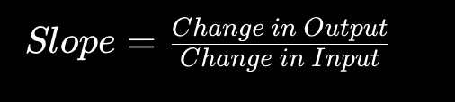

# ML Lab plan
## Step 1 - Create Dataset
```python
# student_marks.py

hours_studied = [1, 2, 3, 4, 5]
marks_scored = [20, 30, 40, 50, 60]

print("Hours Studied:", hours_studied)
print("Marks Scored:", marks_scored)
```
This is 
* dataset
* features
* targets
```python
hours_studied # is features(X) -> Input
marks_scored # is targets(Y) -> Output
```

## Step 2 - Understanding Patterns
```python
for i in range(len(hours_studied)):
    print(hours_studied[i], "hours ->", marks_scored[i], "marks")
```
### OBSERVE

Question: <br>
What pattern do you see?

You should notice:
```
more study → more marks
```
This is exactly what ML learns.

## Step 3 - Manual Prediction
```python
new_hours = 6

predicted_marks = 70

print("Predicted Marks:", predicted_marks)
```
### Right now:
YOU are acting as the ML model manually.

### Later:
the algorithm will learn this automatically.

### Step 4 - Automatic Pattern finding
Now we calcaulate the relationship
```python
difference_hours = hours_studied[1] - hours_studied[0]
difference_marks = marks_scored[1] - marks_scored[0]

slope = difference_marks / difference_hours

print("Slope:", slope)
```

### What is Slope?
Slope tells, if input changes by 1, how much the output changes?
Here,


#### EXPECTED OUTPUT
Slope: 10

#### Meaning:
every extra study hour increases 10 marks

### Slope is used everywhere:

* stock prediction
* pricing systems
* trend analysis
* forecasting

## Step 5 - Build simple prediction logic.
```python
def predict_marks(hours):
    return hours * slope + 10

prediction = predict_marks(6)

print("Prediction for 6 hours:", prediction)
```
### Just built:
* Out FIRST ML prediction system.

* Not using sklearn.
* Not using AI libraries.

## Step 6 - Visualize the Graph using Matplotlib
```python
import matplotlib.pyplot as plt

hours_studied = [1, 2, 3, 4, 5]
marks_scored = [20, 30, 40, 50, 60]

# Plotting the data points
plt.scatter(hours_studied, marks_scored, color='blue', label='Actual Marks')

# Plotting the trend line
plt.plot(hours_studied, marks_scored, color='red', linestyle='--', label='Trend Line')

plt.title("Hours Studied vs Marks Scored")
plt.xlabel("Hours Studied")
plt.ylabel("Marks Scored")
plt.legend()
plt.show()
```
